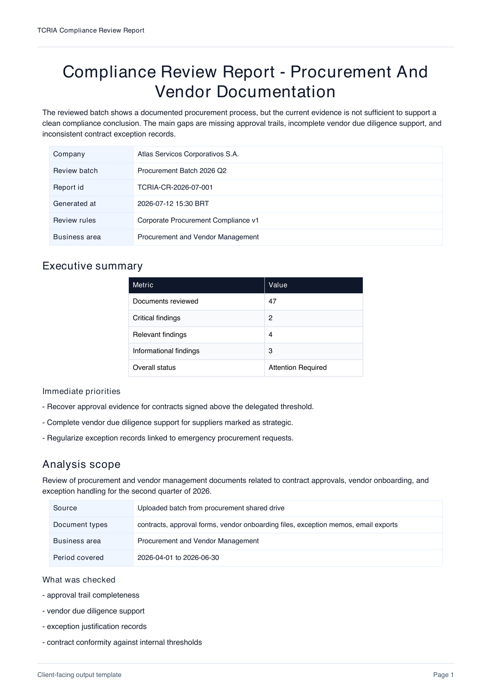
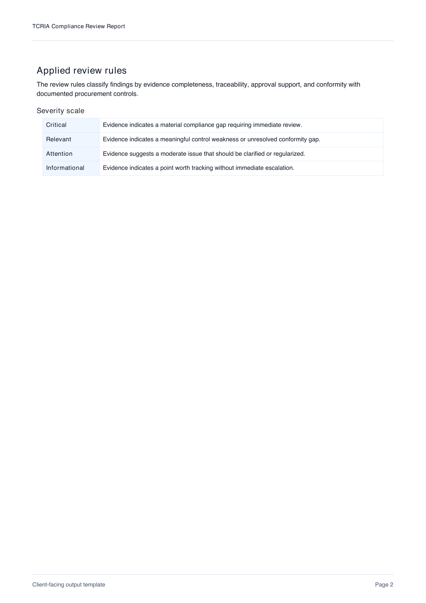

# TCRIA

Compliance review for company document batches with structured, client-facing reports.

TCRIA is a document batch compliance review system.

Its current task is simple and specific: receive a bounded batch of company documents and return a structured compliance review report with findings, evidence references, limits, and next review priorities.

The repository should describe TCRIA as a software product with one primary workflow, clear inputs, clear processing stages, one main deliverable, and explicit limits.

## Report Preview

Example client-facing output:

[Example PDF report](output/pdf/tcria-compliance-report-example.pdf)

## Primary Task

TCRIA exists to do one main job:

- receive a bounded document batch;
- extract relevant content and signals;
- identify compliance and conformity issues;
- organize findings and evidence;
- generate a structured compliance review report.

## Primary Input

The primary input is:

- one bounded document batch submitted for review.

The batch may come from a folder, upload, or workspace, but that packaging detail does not define a different product.

## Primary Output

The primary output is:

- one structured compliance review report.

That report must contain:

- formatted client-facing presentation;
- scope summary;
- compliance findings;
- evidence references;
- conformity gaps or unresolved points;
- unresolved items or limits;
- next review priorities.

## MVP Boundaries

The current repository foundation assumes:

1. the user submits a bounded document batch for review;
2. the system analyzes documents, not an entire company or environment;
3. the system produces a report, not a final institutional decision;
4. document reading and risk judgment are separate steps;
5. imperfect documents are flagged, not automatically discarded;
6. the MVP is centered on one compliance review workflow, not multiple products.

## Documentation Map

- [Repository Scope](docs/repository-constitution.md)
- [Naming Boundaries](docs/naming-boundaries.md)
- [Product Definition](docs/product-vision.md)
- [Analysis Model](docs/analysis-model.md)
- [Governance Profiles](docs/governance-profiles.md)
- [Integration Readiness](docs/integration-readiness.md)
- [Legacy Output Lessons](docs/legacy-output-lessons.md)
- [Legacy Adapter Contract](docs/legacy-adapter-contract.md)
- [Output Specification](docs/output-philosophy.md)
- [Output Taxonomy](docs/output-taxonomy.md)
- [Report Contract](docs/report-contract.md)
- [Report Template](docs/report-template.md)
- [Architecture Layers](docs/architecture/layers.md)
- [Non-Goals](docs/non-goals.md)
- [Contributing](CONTRIBUTING.md)

## Current Repository Focus

The current work in this repository is to define TCRIA objectively as a product:

- what document batch enters the system;
- how the batch is processed;
- what the compliance review report must contain;
- how the report must be formatted for immediate client understanding;
- how imperfect material is handled;
- which components are required for this one workflow;
- what remains outside the MVP.
